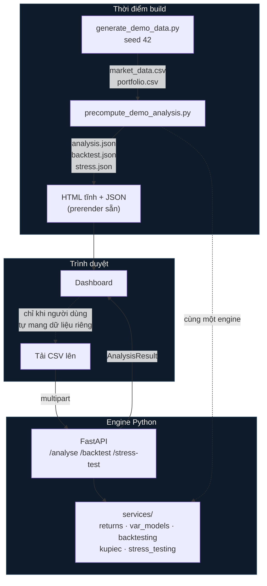

# Tài liệu kỹ thuật (bản dịch tiếng Việt)

Đây là bản dịch tổng hợp tiếng Việt của 6 tài liệu trong thư mục `docs/`:
`architecture.md`, `methodology.md`, `limitations.md`, `deployment.md`,
`demo-script.md`, `research-report-outline.md`. Nội dung được dịch sát nghĩa,
giữ nguyên công thức, bảng biểu, sơ đồ và số liệu. Bản gốc tiếng Anh vẫn là bản
tham chiếu chính thức khi có bất kỳ khác biệt nào.

Mục lục:

1. [Kiến trúc hệ thống](#1-kiến-trúc-hệ-thống)
2. [Phương pháp luận](#2-phương-pháp-luận)
3. [Hạn chế](#3-hạn-chế)
4. [Triển khai](#4-triển-khai)
5. [Kịch bản video demo](#5-kịch-bản-video-demo)
6. [Đề cương báo cáo nghiên cứu](#6-đề-cương-báo-cáo-nghiên-cứu)

---

# 1. Kiến trúc hệ thống

*(Bản dịch của `architecture.md`)*

Lý do hệ thống được thiết kế theo hình dạng như hiện tại. Các quyết định đáng
chú ý không nằm ở việc dùng framework nào, mà ở **chỗ nào các con số được tính
toán** và **khi nào**.

## Hình dạng tổng thể



Đường nét đứt là điểm quan trọng nhất: script precompute và API gọi **cùng một
tầng service**. Chỉ có duy nhất một cách hiện thực cho mỗi công thức.

---

## Quyết định 1 — Bản demo được tính sẵn (precompute), không gọi lúc chạy

**Vấn đề.** Sản phẩm bàn giao quan trọng nhất là một website hoạt động được
mà người đánh giá chỉ mở lên một lần. Các gói hosting miễn phí sẽ cho service
"ngủ" khi không hoạt động; một lần khởi động lại (cold start) có thể mất gần
một phút. Người đánh giá vào lúc 11 giờ đêm — là khách đầu tiên sau nhiều giờ
— sẽ chỉ thấy vòng xoay loading, và có thể đóng tab ngay.

**Quyết định.** Chạy engine tại thời điểm build, ghi kết quả ra file JSON tĩnh,
rồi import JSON đó vào trang. Luồng demo — thứ gần như mọi khách truy cập đều
thấy — được phục vụ dưới dạng HTML tĩnh, không cần gọi Python chút nào.

**Cái giá phải trả.** Các file tính sẵn phải được tạo lại mỗi khi engine hoặc
tập dữ liệu thay đổi, nếu không dashboard sẽ hiển thị những con số mà code
hiện tại không còn tạo ra nữa. CI đảm bảo điều này bằng cách tạo lại và báo
lỗi nếu có bất kỳ khác biệt nào.

**Đây không phải là gì.** Đây không phải là hard-code kết quả. Các con số đến
từ chính đoạn code mà API sử dụng, trên một tập dữ liệu được "đóng băng" bằng
checksum, và việc tạo lại chỉ là một lệnh duy nhất. Sự khác biệt giữa "cache"
và "bịa số liệu" nằm ở chỗ cache có thể được tái tạo lại từ nguồn hay không —
ở đây thì có, và có thể kiểm chứng được.

**Lợi ích kèm theo.** Điều này cũng có nghĩa là frontend được deploy hoàn toàn
như một trang tĩnh. Nếu backend không khả dụng, cấu hình sai, hoặc bị gỡ bỏ
hoàn toàn, phần demo vẫn hoạt động bình thường.

---

## Quyết định 2 — Hợp đồng dữ liệu (contract) được viết trước khi có backend

`frontend/types/analysis.ts` được viết ở Phase 1, khi engine tính toán còn
chưa tồn tại và dashboard chạy trên một bản mock TypeScript dùng tạm.

Thứ tự đó là có chủ đích. Nó buộc interface phải nêu rõ những gì nó cần — bao
gồm quy ước dấu, tính "nullable", và yêu cầu mỗi response phải mang theo các
giả định (assumptions) của nó — trước khi bất kỳ hiện thực nào có thể vô tình
tự định nghĩa những thứ đó một cách tùy tiện. Các model Pydantic ở Phase 2 sau
đó có một mục tiêu cố định để thỏa mãn, thay vì ngược lại.

Hai bên được giữ đồng bộ bằng quy ước chứ không phải bằng codegen: `analysis.py`
phản chiếu `analysis.ts` từng trường một, và cả hai đều mang cùng một đoạn
comment về quy ước. Việc kiểm tra tính tương thích giữa hai schema là một phần
bắt buộc của bất kỳ lần review nào đối với repository này.

**Dùng camelCase xuyên suốt.** PRD mô tả JSON theo kiểu snake_case; một alias
generator của Pydantic phát ra camelCase thay vào đó, để chỉ có một quy ước
đặt tên duy nhất xuyên suốt hệ thống, không có tầng ánh xạ (mapping layer)
nào có thể bị lệch pha.

---

## Quyết định 3 — SciPy là dependency cho test, không phải cho runtime

Engine chỉ cần đúng hai hàm thống kê, và cả hai đều có dạng đóng (closed form)
trong thư viện chuẩn:

| Nhu cầu | Runtime | Được đối chiếu với |
|---|---|---|
| Hàm sống sót (survival function) χ²(1) | `math.erfc(√(x/2))` | `scipy.stats.chi2.sf` |
| Phân vị chuẩn (Normal quantile) | `statistics.NormalDist().inv_cdf` | `scipy.stats.norm.ppf` |
| Thống kê Kupiec | hiệu log-likelihood | `scipy.stats.binom.logpmf` |

SciPy chỉ nằm trong nhóm dependency dành cho phát triển (dev), và được dùng
trong test như một **"trọng tài" độc lập** (independent oracle).

Đây là bằng chứng về tính đúng đắn mạnh hơn nhiều so với việc gọi SciPy trực
tiếp trong production. Một cách hiện thực duy nhất chỉ là một tuyên bố; hai
cách hiện thực độc lập cho ra kết quả khớp nhau đến độ chính xác máy tính thì
loại trừ được khả năng sai sót đại số.

Hiệu ứng về dung lượng là thứ yếu nhưng có thật: các dependency runtime tổng
cộng 79 MB so với giới hạn 250 MB của serverless, và riêng SciPy đã nặng
96 MB. Kể cả nếu tính vào thì vẫn vừa — lý do chính để loại SciPy ra khỏi
runtime là tính đúng đắn, không phải dung lượng.

---

## Quyết định 4 — Cắt lát (slicing) tường minh trong vòng lặp backtest

Vòng lặp walk-forward lấy `values[t-window : t]` bên trong một vòng `for` Python
thuần túy, thay vì dùng một hàm rolling đã được vector hóa sẵn.

Một hàm rolling nếu vô tình bao gồm cả quan sát hiện tại sẽ thổi phồng độ
chính xác biểu kiến của mọi mô hình, trong khi kết quả đầu ra vẫn trông hoàn
toàn hợp lý. Lỗi đó **vô hình trong các con số** — kết quả sẽ trông hợp lý,
kết luận sẽ vô giá trị, và không có gì báo hiệu vấn đề.

Vì tuyên bố cốt lõi của dự án là những dự báo này không bao giờ "nhìn thấy"
kết quả của chính chúng, nên đoạn code đảm bảo điều đó được giữ tường minh dù
phải đánh đổi tốc độ. Sự đảm bảo này sau đó được kiểm chứng theo kiểu đối
kháng (adversarial): một quan sát trong tương lai được thay bằng một ngày
giảm −50%, và mọi dự báo phải giữ nguyên bit-for-bit.

---

## Quyết định 5 — Xuất CSV được tạo ngay trong trình duyệt

Điều kiện hoàn thành của Phase 6 là nội dung file xuất ra phải khớp với phân
tích hiển thị trên màn hình.

Việc tạo file CSV từ chính các đối tượng mà component đang render sẽ **đảm
bảo** điều đó thay vì chỉ kiểm tra nó bằng test. Một bộ xuất file phía server
sẽ phải tính toán lại, và tính toán lại chính là chỗ hai bên có thể âm thầm
lệch nhau.

---

## Cấu trúc thư mục

```
backend/
  app/
    api/v1/router.py         Bề mặt HTTP; parse file upload, không lưu trữ
    schemas/analysis.py      Các model Pydantic, serialize kiểu camelCase
    services/                engine — không import FastAPI, không dùng SciPy
      returns.py             căn chỉnh, lợi suất log, wealth, drawdown
      portfolio_metrics.py   độ biến động, max drawdown, HHI, tỷ trọng ngành
      var_models.py          historical, parametric Normal, EWMA
      expected_shortfall.py
      risk_contribution.py   hiệp phương sai, tương quan, phân rã Euler
      backtesting.py         vòng lặp walk-forward
      kupiec.py               kiểm định độ phủ không điều kiện
      stress_testing.py      cú sốc tùy chỉnh, replay lịch sử
      data_validation.py     các kiểm tra theo PRD 8.5
      analysis.py            điều phối chung
  scripts/
    generate_demo_data.py         tập dữ liệu có seed + manifest checksum
    precompute_demo_analysis.py   chạy engine, ghi ra JSON tĩnh
  tests/                     329 test

frontend/
  app/                       bốn route, đều được prerender tĩnh
  components/
    analysis-data-provider   giữ kết quả phân tích đang hiển thị; khởi tạo bằng demo
    analysis-params-provider giữ các lựa chọn tham số của người dùng
  lib/
    api.ts                   client gọi engine, chỉ dùng cho upload
    csv-export.ts            xuất file phía client
    demo-data.ts             payload đã tính sẵn
  public/demo/               tập dữ liệu đóng băng + phân tích tính sẵn
  tests/                     69 test
```

Tầng `services/` không import bất kỳ web framework nào. Nó có thể được điều
khiển bởi API, bởi script precompute, hoặc bởi một notebook, và các test thao
tác trực tiếp với nó.

---

## Triển khai (deployment)

Cả hai nửa của hệ thống đều được deploy lên Vercel từ cùng một repository:
site Next.js dưới dạng static output, và FastAPI dưới dạng một Python
serverless function trong thư mục `api/`. Cùng một origin, nên không cần CORS
ở môi trường production; `NEXT_PUBLIC_API_URL` tồn tại cho trường hợp backend
nằm ở nơi khác.

Nếu bundle serverless không bao giờ vừa kích thước cho phép, phương án dự
phòng là Hugging Face Spaces cho backend, với `NEXT_PUBLIC_API_URL` trỏ về
đó. Vì phần demo đã được tính sẵn, việc chuyển đổi này chỉ ảnh hưởng đến tính
năng upload — bản thân trang web vẫn hoạt động bình thường trong suốt quá
trình.

---

# 2. Phương pháp luận

*(Bản dịch của `methodology.md`)*

Cách mỗi con số mà ứng dụng báo cáo được tạo ra, đủ chi tiết để người đọc có
thể tái tạo lại từ công thức thay vì phải tin vào code.

Các mục tương ứng với PRD mục 9. Ở đâu có lựa chọn khả dĩ, lựa chọn đó và lý
do của nó đều được nêu rõ: một quy ước không được nêu rõ là cách phổ biến
nhất khiến một con số rủi ro trở nên không thể tái lập.

---

## 1. Các quy ước

Những quy ước này áp dụng ở mọi nơi: trong engine, API và giao diện.

| Đại lượng | Quy ước |
|---|---|
| Lợi suất (returns) | Logarit |
| Tỷ lệ và các con số rủi ro | Số thập phân, không phải phần trăm, cho đến khi hiển thị |
| Tổn thất, VaR, Expected Shortfall | Giá trị **dương** |
| Drawdown (mức sụt giảm) | Giá trị **âm** |
| Quy đổi theo năm (annualisation) | 252 ngày giao dịch |
| Phân vị thực nghiệm | Nội suy tuyến tính giữa các thống kê thứ tự |
| Chỉ số không tính được | `null`, không bao giờ là `0` |

Các quy ước về dấu quan trọng hơn vẻ ngoài của chúng. Một VaR bằng `0.0235`
nghĩa là "tổn thất 2,35%", nên giá trị càng lớn luôn đồng nghĩa với rủi ro
càng cao; một drawdown bằng `-0.547` nghĩa là sụt giảm 54,7%. Lẫn lộn hai
quy ước này là cách dễ nhất để tạo ra một báo cáo rủi ro tự mâu thuẫn nội tại
mà vẫn trông có vẻ ổn.

---

## 2. Lợi suất (Returns)

### 2.1 Lợi suất tài sản

Với giá `P` của tài sản `i` tại ngày `t`:

```
r_{i,t} = ln( P_{i,t} / P_{i,t-1} )
```

Lợi suất logarit được sử dụng vì chúng có tính cộng theo thời gian, giúp
đường cong wealth và các công thức đệ quy phương sai có tính chất tốt.

Quan sát đầu tiên không mang giá trị lợi suất và bị loại bỏ, nên một chuỗi
giá `N` ngày cho ra `N - 1` lợi suất. Sự chênh lệch một đơn vị này lan truyền
tiếp: một chuỗi giá 2.088 ngày cho ra 2.087 lợi suất, và với cửa sổ rolling
250 ngày thì còn lại 1.837 ngày backtest.

### 2.2 Căn chỉnh (Alignment)

Các tài sản được căn chỉnh trên **giao (intersection)** của các ngày giao
dịch của chúng. Bất kỳ ngày nào mà một tài sản được chọn không giao dịch sẽ
bị loại bỏ đối với tất cả các tài sản khác.

Các quan sát bị thiếu **không bao giờ được điền tiếp (forward-fill)**. Việc
giữ nguyên giá cũ sẽ "bịa" ra một ngày mà tài sản đó không hề biến động, làm
sai lệch độ biến động theo hướng thấp hơn thực tế và làm giảm mọi con số rủi
ro tính từ đó. Báo cáo về chất lượng dữ liệu nêu rõ có bao nhiêu quan sát bị
loại, và cảnh báo khi hơn 2% số ngày ứng viên bị mất.

### 2.3 Lợi suất danh mục

Với trọng số cố định `w`:

```
r_{p,t} = Σ_i w_i · r_{i,t}
```

Đây là một phép xấp xỉ, và PRD yêu cầu phải nêu rõ điều này: lợi suất logarit
của một tổng có trọng số không phải là tổng có trọng số của các lợi suất
logarit. Sai số này là bậc hai và không đáng kể ở tần suất ngày, nhưng nó vẫn
là một giả định, không phải một đẳng thức.

Trọng số được giữ cố định trong suốt kỳ phân tích. Không có tái cân bằng, chi
phí giao dịch, thuế hay ràng buộc thanh khoản nào được mô hình hóa.

### 2.4 Đường cong Wealth (giá trị tài sản)

```
W_0 = 100,   W_t = W_{t-1} · exp(r_{p,t})
```

Được hiện thực dưới dạng `100 · exp(cumsum(r))`, tức dạng đóng của công thức
đệ quy trên, giúp tránh tích lũy sai số làm tròn qua từng bước. Một test xác
nhận dạng đóng này khớp với vòng lặp từng bước.

---

## 3. Các chỉ số rủi ro

### 3.1 Độ biến động quy đổi theo năm

```
σ_annual = σ_daily · √252
```

`σ_daily` là độ lệch chuẩn **mẫu** (mẫu số `n − 1`).

Độ biến động đo độ phân tán theo cả hai chiều. Đây không phải là thước đo
tổn thất, và một danh mục có thể có độ biến động vừa phải nhưng lại có phần
đuôi (tail) nghiêm trọng.

### 3.2 Mức sụt giảm tối đa (Maximum drawdown)

Đỉnh chạy (running peak) và drawdown:

```
M_t = max_{s ≤ t} W_s
D_t = W_t / M_t − 1
MDD = min_t D_t
```

Đỉnh được báo cáo là đỉnh chạy **đang có hiệu lực tại đáy (trough)**, không
phải đỉnh toàn cục của chuỗi. Hai giá trị này khác nhau bất cứ khi nào
drawdown tệ nhất không bắt đầu từ mức cao nhất mọi thời đại — với chuỗi
`100 → 120 → 90 → 150 → 200`, drawdown tệ nhất là −25% tính từ đỉnh 120, chứ
không phải tính từ 200. Tính sai điểm này sẽ cho ra một con số trông có vẻ
hợp lý nhưng gắn với sai ngày tháng.

### 3.3 Mức độ tập trung (Concentration)

```
C_max = max_i w_i
HHI   = Σ_i w_i²
w_s   = Σ_{i ∈ s} w_i          (tỷ trọng theo ngành)
```

HHI dao động từ `1/n` đối với danh mục có trọng số bằng nhau, đến `1` đối với
danh mục chỉ có một khoản nắm giữ duy nhất. Không có nhãn định tính nào được
gắn cho các giá trị này; mức độ tập trung chỉ được đánh giá dựa trên các giới
hạn do người dùng tự định nghĩa.

---

## 4. Value at Risk (VaR)

Tổn thất được định nghĩa là `L_t = −r_{p,t}`, nên tổn thất luôn dương.

Với mức độ tin cậy `α`, VaR là phân vị tổn thất tương ứng:

```
P( L > VaR_α ) = 1 − α
```

Ba phương pháp ước lượng được hiện thực, mỗi phương pháp trên một cửa sổ
rolling gồm `W` quan sát gần nhất (mặc định 250).

### 4.1 Mô phỏng lịch sử (Historical Simulation)

```
VaR^HS_α = Q_α( L_{t−W} … L_{t−1} )
```

Phân vị thực nghiệm, sử dụng **nội suy tuyến tính giữa các thống kê thứ tự**
(phương pháp `method="linear"` của NumPy). Quy ước này được cố định trong
đúng một hằng số và được nêu rõ trong khối "assumptions" của mọi response, vì
bảy phương pháp nội suy mà NumPy cung cấp cho kết quả khác nhau chính xác ở
phần đuôi — nơi VaR nằm.

Không đưa ra bất kỳ giả định phân phối nào — đây là điểm mạnh của phương
pháp. Hạn chế của nó mang tính cấu trúc: nó không thể tạo ra một tổn thất lớn
hơn tổn thất lớn nhất đã có trong mẫu, nên không thể dự đoán một cú sốc chưa
từng có tiền lệ.

### 4.2 Chuẩn tham số (Parametric Normal)

```
VaR^N_α = −μ + z_α · σ
```

với `μ` và `σ` là trung bình mẫu và độ lệch chuẩn mẫu của cửa sổ, và `z_α` là
phân vị của phân phối Chuẩn.

Điểm yếu của phương pháp này là giả định phân phối Chuẩn. Lợi suất cổ phiếu
hàng ngày có đuôi "béo" hơn phân phối Chuẩn, nên phương pháp này có xu hướng
đánh giá thấp rủi ro một cách hệ thống ở mức độ tin cậy cao — một dự đoán mà
kết quả backtest xác nhận rõ ràng.

### 4.3 Chuẩn EWMA (EWMA Normal)

Công thức đệ quy phương sai với hệ số suy giảm `λ = 0,94` (quy ước
RiskMetrics):

```
σ²_t = λ · σ²_{t−1} + (1 − λ) · (r_{t−1} − μ)²
VaR^EWMA_α = −μ + z_α · σ_t
```

**Khởi tạo** — điều mà PRD yêu cầu phải được tài liệu hóa và kiểm thử: công
thức đệ quy bắt đầu từ phương sai mẫu của cửa sổ được cung cấp, sau đó tiêu
thụ toàn bộ quan sát trong cửa sổ đó. Giá trị trả về do đó là dự báo một bước
tiếp theo, có điều kiện trên toàn bộ cửa sổ, chứ không phải phương sai
in-sample của phần tử cuối cùng. Một test cố định điều này bằng cách cho
`λ → 1` và kiểm tra hội tụ về ước lượng trọng số đều, và một test thứ hai
kiểm tra công thức đệ quy tại `λ = 0,94` thực tế so với khai triển dạng đóng
của nó.

Vì các quan sát gần đây mang trọng số lớn hơn, phương pháp này phản ứng với
điều kiện thị trường thay đổi nhanh hơn nhiều so với một ước lượng trọng số
đều. Đặc tính đó chính là thứ mà bảng kiểm định mô hình (model audit) được
thiết kế để phát hiện.

### 4.4 Phân vị Chuẩn mà không cần SciPy

`z_α` được tính từ `statistics.NormalDist().inv_cdf(α)` trong thư viện chuẩn.
Bộ test đối chiếu giá trị này với `scipy.stats.norm.ppf`, sai lệch tối đa
≤ 7 × 10⁻¹⁶.

---

## 5. Expected Shortfall (ES) — Tổn thất kỳ vọng

```
ES_α = mean{ L_t : L_t ≥ VaR_α }
```

Tổn thất trung bình vào những ngày ngưỡng bị vi phạm. Trong khi VaR đánh dấu
mép ngoài của phần đuôi, ES mô tả những gì nằm bên trong phần đuôi đó — hai
danh mục có thể có cùng VaR nhưng khác nhau đáng kể về ES.

`ES ≥ VaR` luôn đúng theo quy ước tổn thất dương, do cấu trúc công thức.

Trường hợp phần đuôi rỗng (không có quan sát nào vượt ngưỡng) không thể xảy
ra khi ngưỡng đến từ chính phân vị thực nghiệm, vì một phân vị dưới 100%
không bao giờ vượt quá giá trị lớn nhất trong mẫu. Trường hợp này chỉ có thể
xảy ra khi một ngưỡng bên ngoài được cung cấp — một VaR dựa trên phân phối
Chuẩn có thể nằm cao hơn mọi tổn thất trong mẫu — và trong trường hợp đó,
chính ngưỡng đó được trả về, đây là phát biểu chặt nhất mà mẫu dữ liệu cho
phép và vẫn giữ được `ES ≥ VaR`.

Dạng đóng tùy chọn dưới giả định phân phối Chuẩn:

```
ES^N_α = −μ + σ · φ(z_α) / (1 − α)
```

---

## 6. Đóng góp rủi ro (Risk contribution)

Độ biến động danh mục từ ma trận hiệp phương sai tài sản `Σ`:

```
σ_p = √( wᵀ Σ w )
```

Phân rã Euler:

```
MRC_i = (Σw)_i / σ_p        đóng góp biên (marginal)
RC_i  = w_i · MRC_i          đóng góp thành phần (component)
RC%_i = RC_i / σ_p          tỷ trọng trong tổng
```

Vì `σ_p` là hàm thuần nhất bậc một theo trọng số, định lý Euler cho ra
`Σ_i RC_i = σ_p` **chính xác tuyệt đối**. Các test khẳng định đẳng thức này
bằng số, và kiểm tra riêng từng `MRC_i` so với đạo hàm sai phân trung tâm
(central-difference derivative).

Điều này trả lời câu hỏi "rủi ro đến từ đâu", khác với câu hỏi "tiền nằm ở
đâu". Một khoản nắm giữ nhỏ có thể chi phối rủi ro nếu nó biến động mạnh và
di chuyển cùng chiều với mọi thứ khác; một khoản lớn có thể đóng góp rất ít
nếu nó có tác dụng đa dạng hóa.

---

## 7. Kiểm định mô hình (Model validation)

Sự phân biệt giữa **tính toán** một con số rủi ro và **kiểm định (validate)**
con số đó là tuyên bố phương pháp luận trung tâm của dự án này.

### 7.1 Quy trình walk-forward

Tại mỗi ngày kiểm định `t`, với cửa sổ `W`:

1. lấy các quan sát trong khoảng `[t − W, t)` — nghiêm ngặt trước ngày `t`;
2. ước lượng mô hình chỉ trên lát cắt đó;
3. dự báo ngưỡng tổn thất của ngày tiếp theo;
4. quan sát tổn thất thực tế xảy ra `L_t = −r_{p,t}`;
5. ghi nhận một "exception" (vi phạm ngưỡng) khi `L_t > VaR_{α,t}`.

Phép so sánh là bất đẳng thức **nghiêm ngặt**: một tổn thất bằng chính xác
ngưỡng của nó không được tính là vi phạm.

Việc cắt lát (slicing) được viết tường minh thay vì vector hóa qua một hàm
rolling có sẵn. Một hàm rolling nếu vô tình bao gồm cả quan sát hiện tại sẽ
thổi phồng độ chính xác biểu kiến của mọi mô hình trong khi đầu ra vẫn hoàn
toàn hợp lý — một lỗi vô hình trong các con số và hiển nhiên trong code. Vì
vậy code được giữ tường minh dù phải đánh đổi tốc độ.

Sự đảm bảo này được kiểm thử theo kiểu đối kháng thay vì kiểm tra cấu trúc:
một quan sát trong tương lai được thay bằng một ngày −50%, và mọi dự báo phải
giữ nguyên bit-for-bit; một cú sốc ở giữa chuỗi phải để nguyên các dự báo
trước đó trong khi làm thay đổi các dự báo sau.

### 7.2 Kiểm định độ phủ không điều kiện của Kupiec

Giả thuyết H₀, với mức độ tin cậy `α`:

```
H₀ : p = 1 − α
```

trong đó `p` là xác suất vi phạm thực. Với `T` ngày kiểm định, `x` lần vi
phạm và `p̂ = x/T`:

```
LR_uc = −2 · ln[ (1−p)^(T−x) · p^x  /  (1−p̂)^(T−x) · p̂^x ]
```

Về mặt tiệm cận, `LR_uc ~ χ²(1)` dưới H₀.

**Được tính trong không gian logarit.** Tỷ số thô bị tràn số dưới (underflow):
tại `T = 1838` và `p = 0,05`, riêng tử số đã vào khoảng `10⁻³⁰⁰`. Khai triển
thành hiệu của các log-likelihood giữ cho mọi giá trị trung gian đều biểu
diễn được.

**Các trường hợp biên** được lấy giới hạn trực tiếp thay vì tính `0 · log(0)`
— vốn cho ra `nan` trong số học IEEE và sẽ âm thầm làm hỏng giá trị p:

```
x = 0  →  LR = −2 · T · ln(1 − p)
x = T  →  LR = −2 · T · ln(p)
```

Cả hai trường hợp đều xảy ra trong thực tế — một mô hình 99% trên mẫu ngắn
thường không có vi phạm nào cả.

**Giá trị p mà không cần SciPy.** Với một bậc tự do, hàm sống sót có dạng
đóng:

```
P(X > x) = erfc( √(x/2) )
```

Được đối chiếu với `scipy.stats.chi2.sf`, sai số tương đối tối đa là
5 × 10⁻¹⁴, và bản thân thống kê này được kiểm chứng chéo với một hiệu
log-likelihood nhị thức được xây dựng độc lập (`scipy.stats.binom.logpmf`) —
chính xác tuyệt đối vì hệ số nhị thức triệt tiêu trong tỷ số.

### 7.3 Điều mà kiểm định này KHÔNG khẳng định

Việc không bác bỏ được H₀ **không phải** là bằng chứng cho thấy mô hình đúng.
Nó chỉ có nghĩa là số lần vi phạm quan sát được không mâu thuẫn về mặt thống
kê với tần suất mục tiêu, theo kiểm định này.

Kiểm định này cũng cố tình "mù" trước thời điểm *khi nào* các vi phạm xảy ra.
Mười lần vi phạm rải đều trong năm năm và mười lần vi phạm dồn trong một nửa
tháng cho ra cùng một giá trị thống kê, dù danh mục thứ hai đang gặp rắc rối
nghiêm trọng hơn nhiều. Để phát hiện điều đó cần một kiểm định về tính độc
lập hoặc độ phủ có điều kiện, việc mà PRD xếp vào một giai đoạn sau.

### 7.4 Chọn mô hình

Không có mô hình nào được chọn dựa trên một tiêu chí duy nhất, và không bao
giờ dựa trên việc báo cáo VaR nhỏ nhất. Báo cáo chỉ xếp hạng trong số các mô
hình mà kiểm định Kupiec không bác bỏ, dựa trên khoảng cách **tương đối** so
với mục tiêu:

```
| p̂ − (1−α) | / (1−α)
```

Dùng khoảng cách tương đối, không phải tuyệt đối, vì các hàng ở mức 95% và
99% được so sánh với nhau trong khi mục tiêu của chúng khác nhau đến năm
lần. Một sai lệch 0,5 điểm phần trăm là 10% mất hiệu chuẩn ở mức 95% nhưng là
50% ở mức 99%; xếp hạng theo hiệu số thô sẽ hệ thống hóa việc "tâng bốc" mức
độ tin cậy cao hơn.

Khi hai mô hình chỉ chênh nhau vài phần trăm, câu trả lời được báo cáo là
"không có mô hình đơn lẻ nào vượt trội trên mọi tiêu chí đánh giá" — đây là
một kết luận trung thực và có thể chấp nhận được.

---

## 8. Kiểm tra sức chịu đựng (Stress testing)

Đây là phân tích kịch bản, **không phải** dự báo xác suất. Nó trả lời một câu
hỏi có điều kiện và không gắn bất kỳ khả năng xảy ra nào cho kịch bản đó.

### 8.1 Cú sốc tùy chỉnh

Với vector cú sốc `s`:

```
ΔV_p = wᵀ s
```

Các tài sản không được kịch bản nêu tên được coi là không chịu tác động. Một
cú sốc nêu tên một tài sản mà danh mục không nắm giữ sẽ báo lỗi thay vì bị bỏ
qua âm thầm, vì khả năng cao đó là lỗi gõ nhầm hoặc file không khớp hơn là
một chủ đích thật sự.

### 8.2 Tái diễn kịch bản lịch sử (Historical replay)

Các cú sốc được suy ra từ những gì các tài sản thực sự đã trải qua trong một
khoảng thời gian do người dùng chọn:

```
s_i = P_{i,end} / P_{i,start} − 1
```

**Lợi suất đơn giản (simple returns), không phải lợi suất logarit** — nơi
duy nhất trong codebase rời khỏi không gian logarit. Con số này được áp dụng
theo kiểu nhân với trọng số, nên một sự sụt giảm một nửa phải được đọc là
`−0,50`, không phải `ln(0,5) = −0,69`.

Một kịch bản được tái diễn mang theo bất kỳ mức độ đồng biến động nào mà các
tài sản thực sự có, bao gồm cả hành vi tương quan mà một vector cú sốc tự tạo
sẽ phải đoán mò.

### 8.3 Hạn chế của phương pháp

Phép tính là tuyến tính theo các cú sốc. Nó giả định trọng số giữ nguyên
trong suốt sự kiện, bỏ qua thanh khoản và chi phí giao dịch, và không nắm bắt
được các hiệu ứng vòng hai (second-round) như tương quan tăng lên khi khủng
hoảng diễn ra. Các đợt căng thẳng thực tế có xu hướng gây ra tổn thất lớn hơn
so với những gì một tổng có trọng số ngụ ý.

---

## 9. Khả năng tái lập (Reproducibility)

- Tập dữ liệu demo được tạo ra từ **seed 42** và mã SHA-256 của nó được ghi
  lại trong `frontend/public/demo/manifest.json`. Việc tạo lại được kiểm
  chứng là giống hệt từng byte, chứ không chỉ giả định là vậy.
- Phân tích mà dashboard hiển thị được tính sẵn bởi cùng một engine mà API sử
  dụng, và phải được tạo lại bất cứ khi nào engine hoặc tập dữ liệu thay đổi.
- Các dependency được khóa phiên bản (`uv.lock`, `package-lock.json`).
- Ký tự xuống dòng được chuẩn hóa về LF; nếu không, một lần checkout trên
  Windows sẽ làm thay đổi các file CSV và phá vỡ việc xác minh checksum vì
  một lý do chẳng liên quan gì đến dữ liệu.

---

## 10. Những điều KHÔNG được khẳng định bởi tất cả những điều trên

Mọi con số đều mang tính hồi cứu (backward-looking). Một mô hình tái tạo tốt
các tổn thất trong quá khứ vẫn có thể thất bại khi hành vi thị trường thay
đổi, và các kiểm định ở đây chỉ đo mức độ hiệu chuẩn trên một chuỗi tổng hợp
duy nhất — chúng không nói lên điều gì về thị trường Việt Nam, và không nói
lên điều gì về tương lai.

Xem phần [Hạn chế](#3-hạn-chế) bên dưới để biết đầy đủ.

---

# 3. Hạn chế

*(Bản dịch của `limitations.md`)*

Những gì nguyên mẫu (prototype) này KHÔNG thể cho bạn biết, và tại sao.

Một công cụ rủi ro thẳng thắn liệt kê các hạn chế của chính nó thì hữu ích
hơn một công cụ không làm vậy, vì mọi con số nó đưa ra đều có điều kiện, phụ
thuộc vào các giả định mà người đọc cần phải nhìn thấy. Tài liệu này được
viết để đọc *trước* khi xem kết quả, không phải sau.

---

## 1. Dữ liệu là dữ liệu mô phỏng

Mọi con số hiện đang hiển thị đến từ một chuỗi được tạo ra một cách xác định
(deterministic), không phải từ dữ liệu thị trường Việt Nam thực tế được quan
sát. Các mã cổ phiếu đều là bịa đặt.

Điều này có nghĩa là kết quả chứng minh cho **phương pháp**, không phải cho
thị trường. Các phát biểu như "EWMA là mô hình được hiệu chuẩn tốt nhất" mô
tả cách các ước lượng này hoạt động trên chuỗi tổng hợp này, và không mang
bất kỳ hàm ý nào về các mã trong VN30, VN-Index, hay bất kỳ danh mục thực nào.

Bộ tạo dữ liệu cố tình nhúng hai chế độ biến động (volatility regime) để bảng
kiểm định mô hình có gì đó để phân biệt. Điều này làm cho phần demo có tính
thông tin, đồng thời cũng làm cho nó *dễ hơn* thực tế: các bước chuyển chế độ
sạch sẽ hơn thực tế nhiều, và phân phối lợi suất là hỗn hợp các phân phối
Chuẩn thay vì bất cứ thứ gì lợi suất cổ phiếu thực sự có.

Khi dữ liệu thực được đưa vào, nguồn gốc, ngày lấy dữ liệu, giấy phép, phương
pháp điều chỉnh và các quyết định làm sạch dữ liệu phải được ghi lại trong
[`data/DATA_DICTIONARY.md`](../data/DATA_DICTIONARY.md) trước khi bất kỳ kết
quả nào được báo cáo.

## 2. Trọng số cố định

Trọng số được giữ không đổi trong suốt kỳ phân tích. Không có tái cân bằng
nào được mô hình hóa, cũng không có chi phí giao dịch, thuế, chênh lệch
giá mua-bán (bid-ask spread), hay tác động thị trường của việc giao dịch.

Một danh mục thực tế sẽ trôi dạt (drift) khi giá thay đổi. Một danh mục khởi
đầu 25/25/20/15/15 sẽ không giữ nguyên tỷ trọng đó trong suốt tám năm. Trọng
số cố định làm cho phân tích trở nên khả thi và có thể tái lập, đồng thời
biến nó thành mô tả cho một danh mục *giả định* thay vì bất kỳ danh mục nào
ai đó thực sự đã nắm giữ.

## 3. Lợi suất danh mục là một phép xấp xỉ

`r_p = Σ wᵢ rᵢ` coi lợi suất logarit của danh mục là tổng có trọng số của các
lợi suất logarit tài sản. Đây không phải là một đẳng thức — logarit của một
tổng có trọng số không phải là tổng có trọng số của các logarit. Sai số này
là bậc hai và không đáng kể ở tần suất ngày, nhưng nó vẫn là một giả định.

## 4. Tương quan được coi là ổn định

Ma trận tương quan và hiệp phương sai dùng cho đóng góp rủi ro được ước lượng
trên toàn bộ kỳ phân tích và báo cáo dưới dạng các con số đơn lẻ.

Chúng không hề ổn định. Tương quan thường **tăng lên trong giai đoạn thị
trường căng thẳng**, nghĩa là việc đa dạng hóa có xu hướng thất bại đúng vào
lúc nó cần thiết nhất. Một phép phân rã rủi ro tính trong điều kiện bình
thường sẽ đánh giá thấp mức độ tập trung mà danh mục trở nên khi khủng hoảng
xảy ra.

## 5. Kết quả ở mức 99% dựa trên rất ít quan sát

Ở mức độ tin cậy 99% trên 1.837 ngày kiểm định, số lần vi phạm kỳ vọng vào
khoảng 18 lần. Bất kỳ thống kê nào tính từ khoảng mười tám sự kiện đều mang
độ bất định lớn, và xấp xỉ tiệm cận χ² của kiểm định Kupiec yếu nhất chính ở
đó.

Hãy coi cột 99% chỉ mang tính chỉ báo (indicative). Kết quả ở mức 95%, với
khoảng 92 lần vi phạm kỳ vọng, có nền tảng vững chắc hơn.

## 6. Những gì kiểm định Kupiec KHÔNG kiểm định

Ba giới hạn riêng biệt:

**Đây không phải là bằng chứng của sự đúng đắn.** Không bác bỏ được giả
thuyết H₀ nghĩa là số lần vi phạm quan sát được không mâu thuẫn về mặt thống
kê với tần suất mục tiêu. Điều đó không có nghĩa là mô hình đúng, và với một
mẫu vừa phải, kiểm định này có năng lực hạn chế trong việc phát hiện một mô
hình sai ở mức độ vừa phải.

**Nó "mù" trước hiện tượng dồn cụm (clustering).** Kiểm định chỉ đếm số lần
vi phạm và hoàn toàn bỏ qua thời điểm xảy ra. Mười lần vi phạm rải đều trong
năm năm và mười lần vi phạm dồn trong một nửa tháng cho ra cùng một giá trị
thống kê — nhưng một danh mục vi phạm ngưỡng của nó mười ngày liên tiếp đang
ở trong một tình huống hoàn toàn khác. Phát hiện điều đó cần một kiểm định về
tính độc lập hoặc độ phủ có điều kiện, chưa được hiện thực.

**Nó không nói lên điều gì về mức độ nghiêm trọng.** Một mô hình có thể tạo
ra đúng số lần vi phạm trong khi những vi phạm đó lại cực kỳ lớn. Expected
Shortfall giải quyết một phần vấn đề này; kiểm định thì không.

## 7. So sánh mô hình chỉ dùng một tiêu chí

Dòng "mô hình được kiểm định tốt nhất" chỉ xếp hạng dựa trên khoảng cách
tương đối so với tần suất vi phạm mục tiêu, trong số các mô hình mà kiểm định
Kupiec không bác bỏ.

Nó không cân nhắc mức độ nghiêm trọng của vi phạm, tính ổn định qua các chế
độ biến động khác nhau, hay chi phí tính toán — tất cả đều được PRD nêu tên
là tiêu chí. Đặc biệt, việc so sánh theo chế độ (regime comparison) chưa được
hiện thực, nên một mô hình được hiệu chuẩn tốt trung bình nhưng thất bại nặng
trong các giai đoạn biến động mạnh sẽ không được phân biệt ở đây.

## 8. Kiểm tra sức chịu đựng là tuyến tính và đơn kỳ (single-period)

Phép tính kịch bản là `wᵀs`. Do đó nó giả định:

- trọng số giữ nguyên trong suốt sự kiện;
- các cú sốc xảy ra đồng thời, không có phụ thuộc theo đường đi (path
  dependence);
- không có ràng buộc thanh khoản — mọi vị thế đều có thể giữ hoặc bán với giá
  đã mô hình hóa;
- không có hiệu ứng vòng hai, không có lây lan (contagion), không có sự thay
  đổi tương quan giữa khủng hoảng.

Các đợt căng thẳng thực tế có xu hướng **tệ hơn** so với những gì một tổng có
trọng số ngụ ý, chính vì những lý do trên.

Các kịch bản lịch sử cũng, theo cấu trúc, là những giai đoạn tệ nhất *trong
mẫu dữ liệu*. Đó là một mô tả về quá khứ. Nó không đặt ra bất kỳ giới hạn nào
cho tương lai, và cuộc khủng hoảng tiếp theo không có nghĩa vụ phải giống
cuộc khủng hoảng trước.

## 9. Chỉ có kỳ hạn một ngày

Mọi con số VaR và ES đều là dự báo một ngày. Rủi ro đa ngày không được mô
hình hóa, và quy tắc quy đổi `√h` phổ biến không được áp dụng — vì nó giả
định các lợi suất độc lập, điều mà hiện tượng dồn cụm biến động
(volatility clustering) vi phạm.

## 10. Không điều chỉnh cho các sự kiện doanh nghiệp

Dữ liệu demo sử dụng giá đóng cửa. Chuỗi giá thực tế cần được điều chỉnh cho
cổ tức, chia tách cổ phiếu và phát hành quyền mua; một chuỗi chưa điều chỉnh
sẽ cho thấy một sự sụt giảm giả tạo vào ngày giao dịch không hưởng quyền
(ex-dividend), điều mà mô hình sẽ đọc thành một khoản tổn thất.

Schema hỗ trợ một cột `adjusted_close`, và engine sẽ ưu tiên sử dụng cột đó
nếu có và báo cáo rằng đã làm vậy. Cho đến khi dữ liệu thực với cột này xuất
hiện, kết quả vẫn mang hạn chế này.

## 11. Chưa được kiểm định cho bất kỳ mục đích sử dụng thực tế nào

Đây là một nguyên mẫu của học sinh, được xây dựng cho hồ sơ ứng tuyển đại
học. Nó chưa được đối chiếu với một hệ thống rủi ro production, chưa được
một chuyên gia thực hành review, và không có audit trail, kiểm soát truy cập,
quy trình quản trị mô hình (model governance) hay kỷ luật kiểm soát thay đổi
(change control) như một bộ phận rủi ro thực tế yêu cầu.

Nó không nên được dùng để đưa ra quyết định đầu tư, và không có gì trong đó
phù hợp cho mục đích báo cáo theo quy định (regulatory reporting).

---

## Những gì cần thiết cho một hệ thống production

Việc liệt kê trung thực điều này chính là một phần mục đích của bài tập:

- Dữ liệu thị trường thực, đã điều chỉnh, có bản quyền hợp pháp, với nhà cung
  cấp và quy trình đối soát được ghi lại rõ ràng.
- Các kiểm định về tính độc lập và độ phủ có điều kiện, song song với độ phủ
  không điều kiện.
- Rủi ro đa kỳ hạn với một phương pháp quy đổi có cơ sở vững chắc.
- Kiểm tra sức chịu đựng có điều chỉnh thanh khoản, với ràng buộc ở cấp độ
  vị thế.
- Quản trị mô hình: kiểm soát phiên bản, phê duyệt, tái kiểm định định kỳ,
  các mô hình đối chứng (challenger models).
- Nhật ký kiểm toán (audit trail) cho mọi lần chạy phân tích và mọi thay đổi
  tham số.
- Xác thực, phân quyền và phân tách dữ liệu.
- Kiểm định độc lập bởi người không tham gia xây dựng hệ thống.

Khoảng cách giữa nguyên mẫu này và danh sách trên chính là câu trả lời trung
thực cho câu hỏi "hệ thống này đã sẵn sàng cho production chưa", và khoảng
cách đó rất lớn.

---

# 4. Triển khai

*(Bản dịch của `deployment.md`)*

> **Trạng thái: đã viết, chưa được kiểm chứng.** Chưa có gì được deploy thực
> sự. Cấu hình trong `vercel.json`, `api/index.py` và `requirements.txt` là
> một điểm khởi đầu đã được cân nhắc kỹ, chứ không phải một cấu hình đã được
> chứng minh hoạt động — một monorepo với một Python function nằm cạnh một
> ứng dụng Next.js trong một thư mục con chính là kiểu bố trí thường cần một
> hoặc hai điều chỉnh khi chạy thử lần đầu. Tài liệu này ghi lại những gì cần
> mong đợi và cần làm gì nếu nó không chạy đúng ngay từ lần đầu.

Mọi thứ dùng ở đây đều miễn phí. Tổng chi phí vận hành: bằng không.

---

## Những gì đang được deploy

Hai phần thất bại độc lập với nhau, theo chủ đích thiết kế:

| | Phụ thuộc vào | Hậu quả nếu bị lỗi |
|---|---|---|
| **Trang web (site)** | Không phụ thuộc gì lúc chạy | Thất bại hoàn toàn — đây là sản phẩm bàn giao |
| **API upload** | Python function "thức dậy" | Phần demo không bị ảnh hưởng |

Phần demo được tính sẵn thành JSON tĩnh và được import vào lúc build, nên
trang web thực sự là tĩnh hoàn toàn. Đó là điều làm cho rủi ro trở nên bất
đối xứng và việc deploy trở nên khả thi: phần không được phép thất bại gần
như không có cách nào để thất bại.

---

## Thứ tự công việc

Deploy trang web trước và xác nhận nó hoạt động trước khi động vào Python
function. Trang web là sản phẩm bàn giao; API chỉ là một tính năng.

### 1. Push lên GitHub

Repository phải ở chế độ **public** — repository public được cấp số phút
GitHub Actions không giới hạn, và bản thân repository cũng là một sản phẩm
bàn giao.

```bash
git remote add origin https://github.com/<user>/vn-portfolio-risk-auditor.git
git push -u origin main
```

Xác nhận workflow CI chạy và pass trước khi tiếp tục.

### 2. Deploy trang web

Import repository tại [vercel.com/new](https://vercel.com/new).

Gói Hobby là miễn phí và yêu cầu sử dụng phi thương mại, điều mà một dự án
portfolio phục vụ mục đích học tập đáp ứng được.

Nếu Vercel không tự nhận diện cấu hình, hãy đặt:

| Cài đặt | Giá trị |
|---|---|
| Framework preset | Next.js |
| Root directory | `frontend` |
| Build command | *(mặc định)* |

Đặt root directory là `frontend` là cách bố trí đơn giản nhất và đáng thử
trước tiên. **Cách này sẽ vô hiệu hóa Python function**, vì `api/` khi đó
nằm ngoài phạm vi build — điều này không sao cả, và chính là cách tách được
mô tả ở bước 4.

Xác minh: cả bốn route đều load được, các thẻ chỉ số hiển thị số liệu, bảng
Model Audit có dữ liệu, và các kịch bản stress test xuất hiện. Không điều nào
trong số đó cần đến API.

### 3. Thử Python function

Chỉ làm bước này nếu bạn muốn tính năng upload chạy cùng một origin với site.

Đặt lại root directory về gốc repository để `vercel.json` điều khiển quá
trình build. Hãy chuẩn bị tinh thần thử-sai nhiều lần ở bước này.

**Những thứ có khả năng gặp lỗi**

| Triệu chứng | Nguyên nhân khả dĩ |
|---|---|
| Next.js không được nhận diện | Root directory hoặc `outputDirectory` sai cho cấu trúc monorepo |
| `ModuleNotFoundError: app` | Việc chèn `sys.path` trong `api/index.py` không phân giải đúng trên hệ thống file của runtime |
| Function vượt quá giới hạn kích thước | Khó xảy ra — đã đo được 79 MB so với giới hạn 250 MB — nhưng wheel Linux khác với số đo trên Windows |
| Lỗi 404 tại `/api/v1/health` | Rewrite không khớp; kiểm tra mục `rewrites` trong `vercel.json` |
| Timeout ở request đầu tiên | Cold start. `maxDuration` đã được đặt là 60 giây |

Xác minh bằng:

```bash
curl https://<your-deployment>/api/v1/health
# {"status":"ok","version":"0.1.0"}
```

### 4. Phương án dự phòng: tách việc deploy ra làm hai

Nếu cách bố trí cùng một origin gặp trở ngại, hãy chuyển sang phương án tách
riêng. Đây không phải là một thất bại — có thể coi đây là cách bố trí bền
vững hơn, và đây cũng chính là kế hoạch dự phòng đã được tính đến ngay từ
đầu.

- **Site** trên Vercel, root directory là `frontend`.
- **API** trên [Hugging Face Spaces](https://huggingface.co/spaces) (miễn
  phí, dùng Docker, không giới hạn kích thước bundle) hoặc bất kỳ host nào
  chạy được tiến trình Python.
- Đặt `NEXT_PUBLIC_API_URL` trong project Vercel trỏ về origin của API.
- Thêm origin đó vào `ALLOWED_ORIGINS` phía backend, vì lúc này CORS bắt đầu
  áp dụng.

Trang web vẫn tiếp tục hoạt động trong suốt quá trình di chuyển, vì phần demo
chưa bao giờ phụ thuộc vào API.

---

## Biến môi trường

| Biến | Nơi đặt | Mục đích |
|---|---|---|
| `NEXT_PUBLIC_API_URL` | Project Vercel | Origin của API. Để trống nếu dùng chung origin. |
| `ALLOWED_ORIGINS` | Host của backend | Danh sách cho phép CORS, phân tách bằng dấu phẩy. Chỉ cần khi tách riêng. |
| `MAX_UPLOAD_BYTES` | Host của backend | Giới hạn dung lượng upload. Mặc định 8 MB. |

Không có secret nào. Ứng dụng không có database, không có xác thực và không
có thông tin đăng nhập bên thứ ba nào, nên không có gì để bị lộ.

---

## Sau khi deploy

- [ ] Cả bốn route đều load được, có số liệu, trong một cửa sổ ẩn danh
      (incognito)
- [ ] Giao diện di động hoạt động trên điện thoại thật, không chỉ là trình
      duyệt được resize
- [ ] Trang Report in ra không bị cắt nội dung
- [ ] `/api/v1/health` phản hồi, hoặc phương án tách riêng đã sẵn sàng và
      upload hoạt động
- [ ] Upload các file CSV mẫu từ `frontend/public/demo/` từ đầu đến cuối
- [ ] Badge CI hiển thị xanh trên README
- [ ] Đã chụp ảnh màn hình cho README và poster

---

## Lưu ý về gói miễn phí

Điều khoản của các gói miễn phí thay đổi, và thường thay đổi mà không báo
trước nhiều. Hãy xác minh giới hạn hiện tại trước khi dựa vào bất kỳ điều
khoản nào trong số đó.

Kiến trúc được sắp xếp có chủ đích để việc chuyển host trở nên rẻ: phần demo
là tĩnh, backend là FastAPI thuần túy không dùng API riêng của bất kỳ host
nào, và origin của API chỉ là một biến môi trường duy nhất. Việc di chuyển
backend nên chỉ mất một buổi chiều, không phải một lần viết lại từ đầu.

---

# 5. Kịch bản video demo

*(Bản dịch của `demo-script.md`, dài khoảng 2 đến 3 phút)*

Dành cho video demo theo yêu cầu của PRD mục 24.

Bản năng tự nhiên là muốn trình bày mọi tính năng. Hãy cưỡng lại điều đó. Một
video ba phút truyền tải rõ ràng **một** ý còn hơn một video liệt kê mười hai
tính năng, và ý đáng nói nhất chính là điều làm dự án này khác biệt với một
dashboard thông thường: *mô hình đã được kiểm định, chứ không chỉ được tính
toán.*

Tổng thời lượng: ~2:45. Các mốc thời gian chỉ mang tính hướng dẫn, không phải
mục tiêu cứng.

---

## 0:00 – 0:20 — Vấn đề

> "Bất kỳ công cụ rủi ro nào cũng có thể tính ra một con số Value at Risk.
> Công cụ này đặt ra một câu hỏi khó hơn: liệu con số đó có từng đúng hay
> không?"

**Trên màn hình:** Trang Overview, đã load sẵn.

Chỉ vào thẻ VaR 95% — 2,35%.

> "Con số này nói rằng danh mục sẽ mất hơn 2,35% vào khoảng một ngày trong
> hai mươi ngày. Đó là một tuyên bố có thể kiểm chứng được, và gần như không
> có gì kiểm tra nó cả."

Nói sớm và chỉ một lần rằng dữ liệu là mô phỏng. Không cần nhấn mạnh quá
nhiều; nhãn này đã hiển thị xuyên suốt video.

---

## 0:20 – 0:50 — Những gì dashboard hiển thị

**Trên màn hình:** Overview.

Di chuyển nhanh. Phần này tồn tại để thể hiện năng lực, không phải để giải
thích mọi thứ.

- Bốn thẻ chỉ số — độ biến động, VaR, Expected Shortfall, mức sụt giảm tối đa.
- Một câu về lý do có ES: *"VaR đánh dấu mép ngoài của phần đuôi. Expected
  Shortfall cho biết bên trong phần đuôi đó có gì — 3,63% so với ngưỡng
  2,35%."*
- Bảng đóng góp rủi ro: *"Rủi ro đến từ đâu là một câu hỏi khác với tiền nằm
  ở đâu."*

Không cần thuyết minh ma trận tương quan hay bảng phân bổ. Chúng đã hiển thị
sẵn trên màn hình; như vậy là đủ.

---

## 0:50 – 1:40 — Phần cốt lõi: kiểm định mô hình

**Trên màn hình:** Model Audit.

Đây là trái tim của video. Chậm lại.

> "Ba mô hình. Mỗi mô hình chỉ được ước lượng bằng dữ liệu trước ngày nó dự
> báo — không bao giờ thấy trước kết quả của chính nó. Sau đó chạy tiến qua
> 1.837 ngày giao dịch và đếm lại."

Chỉ vào bảng.

> "Một mô hình 95% lẽ ra phải bị vi phạm khoảng 92 lần. Mô hình Historical
> Simulation bị vi phạm 116 lần — kiểm định Kupiec bác bỏ nó. EWMA bị vi phạm
> 105 lần, và không bị bác bỏ."

Rồi đến phát hiện đáng giá nhất video:

> "Nhìn vào Parametric Normal. Nó đạt (pass) ở mức 95%. Ở mức 99%, nó thất
> bại dứt khoát với giá trị p dưới 0,0001 — 39 lần vi phạm trong khi kỳ vọng
> chỉ 18 lần. Đó chính là biểu hiện của một giả định đuôi mỏng: ổn ở giữa
> phân phối, sai nghiêm trọng ở phần đuôi. Cùng một mô hình, được kiểm định
> đạt ở mức độ tin cậy này nhưng không dùng được ở mức độ tin cậy khác."

Rồi câu cho thấy bạn hiểu bản chất thống kê:

> "Việc đạt kiểm định ở đây không chứng minh mô hình đúng. Nó chỉ có nghĩa là
> số lần vi phạm không mâu thuẫn về mặt thống kê với những gì mô hình đã hứa.
> Sự phân biệt đó rất quan trọng."

Chuyển biểu đồ sang chế độ xem **Loss**. Để các điểm đánh dấu vi phạm màu san
hô (coral) hiện ra.

> "Mỗi chấm là một ngày mà tổn thất vượt qua ngưỡng được dự báo cho ngày đó."

---

## 1:40 – 2:10 — Kiểm tra sức chịu đựng

**Trên màn hình:** Stress Test.

> "Kiểm tra sức chịu đựng đặt ra một câu hỏi có điều kiện — nếu điều này xảy
> ra thì sao. Nó không gắn bất kỳ xác suất nào cho kịch bản."

Click qua các kịch bản lịch sử.

> "Đây không phải là các vector cú sốc bịa ra. Engine đã tìm trong tập dữ
> liệu những giai đoạn tệ nhất và tái diễn chúng với trọng số hiện tại, nên
> chúng mang theo bất kỳ mức độ đồng biến động nào mà các tài sản thực sự đã
> có."

Chỉ vào tuần tệ nhất: −22,99%.

> "Tuần tệ nhất khiến mất gần 23%. VaR một ngày ở mức 95% chỉ là 2,35%.
> Khoảng cách đó chính là lý do stress test tồn tại."

Có thể kéo thử một thanh trượt (slider) tùy chỉnh để cho thấy nó phản hồi
trực tiếp. Hai giây, không hơn.

---

## 2:10 – 2:35 — Khả năng tái lập

**Trên màn hình:** Trang Report, sau đó cắt nhanh sang terminal.

> "Mọi thứ đều có thể tái lập. Tập dữ liệu được tạo từ seed 42 và được
> checksum — tạo lại nó và mã SHA-256 sẽ giống hệt. Phân tích được tính bởi
> chính engine Python mà API sử dụng."

Terminal, một lệnh duy nhất, để nó chạy xong:

```bash
uv run --directory backend pytest -q
```

> "329 test. Những test quan trọng nhất kiểm tra rằng không có dự báo nào
> từng nhìn thấy trước kết quả của chính nó — một quan sát tương lai được
> thay bằng một ngày âm năm mươi phần trăm, và mọi dự báo phải trở lại giống
> hệt bit-for-bit."

Quay lại trang Report. Click xuất một file CSV để file được tải về.

---

## 2:35 – 2:45 — Kết thúc

> "Nó không dự đoán giá và không khuyến nghị giao dịch. Nó đo lường rủi ro
> giảm giá (downside risk), giải thích rủi ro đến từ đâu, và kiểm định xem mô
> hình tạo ra những con số đó có đáng tin trên dữ liệu nó đã được kiểm định
> hay không.
>
> Dữ liệu ở đây là mô phỏng, nên nó chứng minh cho phương pháp, không phải
> cho thị trường."

Kết thúc ở trang Overview.

---

## Ghi chú sản xuất

**Ghi hình ở độ phân giải 1920×1080**, trình duyệt rộng khoảng 1440px để bố
cục desktop với thanh điều khiển cố định (docked rail) hiển thị đầy đủ. Zoom
trình duyệt lên 110% — chữ trên màn hình đọc ổn khi xem trực tiếp nhưng lại
nhỏ khi xem trong video đã nén.

**Khởi động sẵn cả hai server** (đã "ấm") trước khi ghi hình. Một vòng xoay
loading trong video demo là điều có thể tránh được và trông giống như một
lỗi.

**Không ghi hình luồng upload** trừ khi video còn thời lượng dư. Nó cần
backend đã "thức" và tạo thêm một điểm có thể lỗi trong ba mươi giây thời
lượng video. Thay vào đó, chỉ cần nhắc trong một mệnh đề ngắn: *"bạn có thể
tải lên file CSV của riêng mình"*.

**Mỗi phần quay một lần (one take)**, cắt giữa các phần. Cố gắng quay liền
mạch 2:45 không ngắt cho kết quả tệ hơn bốn đoạn quay sạch sẽ.

**Tắt thông báo (notifications).** Đóng các tab khác.

### Những điều KHÔNG nên nói

- "Mô hình tốt nhất" — hãy nói *"mô hình duy nhất không bị bác bỏ ở cả hai
  mức độ tin cậy"*.
- "Chứng minh" — hãy nói *"phù hợp với"* hoặc *"không bị bác bỏ"*.
- "An toàn", "rủi ro thấp", "được đảm bảo" — không có tuyên bố nào trong số
  này là những gì công cụ này đưa ra.
- Bất cứ điều gì ngụ ý rằng kết quả mô tả cổ phiếu Việt Nam thực tế.

### Nếu video chạy quá dài

Cắt phần khả năng tái lập xuống còn một câu duy nhất trên nền một ảnh tĩnh
hiển thị số test đã pass. Cắt phần giới thiệu Overview xuống còn bốn thẻ chỉ
số. Không bao giờ cắt phần model audit — thiếu nó, đây chỉ là một dashboard,
và dashboard thì không thú vị.

---

# 6. Đề cương báo cáo nghiên cứu

*(Bản dịch của `research-report-outline.md`)*

Cấu trúc theo PRD mục 19. Độ dài mục tiêu: 8–12 trang.

Đây là một khung sườn (scaffold), không phải một bản nháp. Các con số bên
dưới là những gì phiên bản hiện tại của hệ thống tạo ra; lập luận kết nối
chúng là việc của bạn viết, và viết lập luận đó chính là phần lớn công sức
trí tuệ của bài. Ở đâu một mục cần một nhận định (judgement) thay vì chỉ một
con số, điều đó được đánh dấu rõ.

**Tên tạm đặt:** *VN Portfolio Risk Auditor: Một nền tảng nguyên mẫu giám
sát rủi ro, kiểm định mô hình và kiểm tra sức chịu đựng cho thị trường cổ
phiếu Việt Nam*

---

## Tóm tắt (Abstract) (~200 từ, viết sau cùng)

Mỗi câu một ý: vấn đề, dữ liệu, các mô hình, phương pháp kiểm định, nguyên
mẫu, phát hiện chính, hạn chế chủ yếu.

Phát hiện đáng để mở đầu là phát hiện mà kết quả thực sự chứng minh: *ba
phương pháp ước lượng không thống nhất với nhau, và sự không thống nhất đó
mang tính hệ thống chứ không ngẫu nhiên — mô hình thích ứng (adaptive)
vượt qua kiểm định ở cả hai mức độ tin cậy trong khi các mô hình tĩnh
(static) thì không, và mô hình Chuẩn thất bại đặc biệt ở phần đuôi.*

Không tuyên bố bất cứ điều gì về thị trường Việt Nam. Dữ liệu là mô phỏng và
phần tóm tắt phải nói rõ điều đó.

---

## 1. Giới thiệu (~1 trang)

- Bối cảnh tài chính định lượng: đo lường rủi ro như một lĩnh vực tách biệt
  khỏi dự báo lợi suất.
- Rủi ro thị trường của danh mục và lý do một con số đơn lẻ là không đủ.
- **Khoảng trống trung tâm**: các mô hình thường xuyên được tính toán và
  hiếm khi được kiểm định. Bất kỳ mô hình nào cũng có thể tạo ra một con số
  VaR; liệu con số đó có bị vi phạm với tần suất gần đúng như nó đã hứa hay
  không là một câu hỏi riêng biệt, có thể kiểm chứng được, nhưng thường bị bỏ
  qua.
- Động lực từ thị trường mới nổi: thanh khoản mỏng hơn, biến động cao hơn,
  lịch sử dữ liệu khả dụng ngắn hơn — những điều kiện mà lựa chọn mô hình trở
  nên quan trọng hơn.
- Mục tiêu nghiên cứu và năm câu hỏi nghiên cứu (PRD mục 6.2).

Nêu sớm rằng dữ liệu là mô phỏng và giải thích tại sao điều đó vẫn chấp nhận
được cho câu hỏi đang được đặt ra: nghiên cứu này đánh giá *hành vi của các
ước lượng dưới các điều kiện đã biết trước*, và một chuỗi được tạo ra cho
phép cấu trúc chế độ (regime) được biết trước thay vì phải suy luận.

---

## 2. Tổng quan tài liệu và khung lý thuyết (~2 trang)

### 2.1 Lý thuyết danh mục hiện đại (Modern Portfolio Theory)
Markowitz (1952). Lợi suất danh mục, phương sai, hiệp phương sai, tương quan,
đa dạng hóa. Đặt nền tảng cho phần phân rã đóng góp rủi ro tại đây.

### 2.2 Rủi ro giảm giá (Downside risk)
VaR như một phân vị tổn thất. Expected Shortfall như trung bình có điều kiện
của phần đuôi. Rockafellar & Uryasev về CVaR. Tại sao độ biến động đơn thuần
là không đủ: nó đối xứng và không nói lên điều gì về hình dạng phần đuôi.

Đáng nói rõ: VaR không có tính "coherent" (nó không thỏa mãn tính cộng dưới —
subadditivity), ES thì có.

### 2.3 Ước lượng VaR
Historical Simulation, Parametric Normal, EWMA (RiskMetrics), Monte Carlo như
một phần mở rộng. Với mỗi phương pháp: giả định nó đưa ra và chế độ thất bại
theo sau giả định đó.

### 2.4 Kiểm định mô hình
Backtest kiểu walk-forward. Tần suất vi phạm (exception rate). Kupiec (1995)
— độ phủ không điều kiện. Christoffersen về tính độc lập và độ phủ có điều
kiện — trích dẫn như khoảng trống mà hiện thực này chưa lấp đầy. Yêu cầu
backtest rủi ro thị trường của Basel như tương đồng về mặt quy định.

### 2.5 Kiểm tra sức chịu đựng
Kịch bản lịch sử so với kịch bản giả định. Tại sao phân tích kịch bản tuyến
tính đánh giá thấp các đợt căng thẳng thực tế. Giới hạn rủi ro như một hình
thức quản trị nội bộ.

---

## 3. Phương pháp luận (~2 trang)

Cô đọng lại từ phần [Phương pháp luận](#2-phương-pháp-luận) ở trên. Mọi công
thức, mọi quy ước.

Hãy dành riêng một đoạn cho mỗi điều sau — đây là những phần người chấm có
thể kiểm tra được:

- **Quy ước dấu và phân vị.** Tổn thất dương, drawdown âm, nội suy tuyến
  tính giữa các thống kê thứ tự — được nêu rõ chứ không phải kế thừa ngầm.
- **Khởi tạo EWMA.** Phương sai mẫu của cửa sổ, sau đó tiêu thụ toàn bộ cửa
  sổ; giá trị trả về là một dự báo một-bước-tiếp-theo.
- **Quy tắc walk-forward.** Quan sát trong `[t−W, t)` và không gì khác. Giải
  thích tại sao đây là cốt lõi phương pháp luận, và cách nó được kiểm thử
  theo kiểu đối kháng thay vì chỉ kiểm tra bằng mắt.
- **Kupiec trong không gian logarit**, với các giới hạn `x=0` và `x=T` được
  lấy trực tiếp.
- **Kiểm chứng độc lập.** Các hiện thực trong thư viện chuẩn được đối chiếu
  chéo với SciPy — lập luận tại sao hai hiện thực đồng thuận là bằng chứng
  mạnh hơn một hiện thực đơn lẻ được khẳng định.

### Dữ liệu

Được tạo ra, seed 42, năm mã cổ phiếu hư cấu cộng với một chỉ số benchmark,
2.088 ngày giao dịch trải từ 2018-01-01 đến 2025-12-31. Mô hình yếu tố thị
trường (market-factor model) với hệ số beta riêng cho từng tài sản và nhiễu
đặc thù (idiosyncratic noise), cộng thêm hai giai đoạn biến động cao được cố
ý đưa vào.

Cần nói rõ rằng cấu trúc chế độ (regime) là *được thiết kế có chủ đích*, và
giải thích tại sao: điều đó làm cho việc so sánh giữa ước lượng thích ứng
(adaptive) và tĩnh (static) trở nên quan sát được thay vì phụ thuộc vào may
rủi.

---

## 4. Thiết kế hệ thống (~1 trang)

Vấn đề của người dùng, đầu vào, đầu ra, kiến trúc, pipeline tính toán.

Hai quyết định thiết kế đáng dành riêng mỗi quyết định một đoạn được nêu
trong phần [Kiến trúc hệ thống](#1-kiến-trúc-hệ-thống) ở trên: tính sẵn phần
demo để trang web không phụ thuộc vào một backend đang "ngủ", và viết hợp
đồng dữ liệu (API contract) trước khi engine tồn tại.

Đính kèm sơ đồ kiến trúc.

---

## 5. Kết quả (~2 trang)

### 5.1 Thống kê mô tả

| Đại lượng | Giá trị |
|---|---|
| Kỳ phân tích | 2018-01-01 → 2025-12-31 |
| Số quan sát đã căn chỉnh | 2.088 |
| Số tài sản | 5 + benchmark |
| Độ biến động quy đổi theo năm | 24,63% |
| Mức sụt giảm tối đa | −54,68% |

### 5.2 Các chỉ số rủi ro ở mức toàn mẫu

| Chỉ số | Giá trị |
|---|---|
| VaR một ngày, 95% (Historical) | 2,35% |
| Expected Shortfall 95% | 3,63% |
| Tài sản đóng góp rủi ro lớn nhất | ASSET_B (29,7% độ biến động danh mục, trên trọng số 25%) |
| HHI | 0,2100 |

Lưu ý rằng ES vượt VaR khoảng 55% — phần đuôi tệ hơn đáng kể so với những gì
riêng ngưỡng VaR gợi ý, đây chính là câu trả lời thực nghiệm cho câu hỏi
nghiên cứu RQ5.

### 5.3 So sánh mô hình và backtest — kết quả cốt lõi

Walk-forward, cửa sổ 250 ngày, 1.837 ngày kiểm định:

| Mô hình | Tin cậy | Vi phạm | Kỳ vọng | Tỷ lệ | Kupiec LR | p | Kết quả |
|---|---:|---:|---:|---:|---:|---:|---|
| Historical Simulation | 95% | 116 | 91,9 | 6,31% | 6,19 | 0,0128 | không đạt |
| Historical Simulation | 99% | 34 | 18,4 | 1,85% | 10,74 | 0,0010 | không đạt |
| Parametric Normal | 95% | 109 | 91,9 | 5,93% | 3,19 | 0,0741 | đạt |
| Parametric Normal | 99% | 39 | 18,4 | 2,12% | 17,70 | <0,0001 | không đạt |
| EWMA Normal | 95% | 105 | 91,9 | 5,72% | 1,90 | 0,1683 | đạt |
| EWMA Normal | 99% | 23 | 18,4 | 1,25% | 1,09 | 0,2961 | đạt |

Hai phát hiện cần khai triển thêm:

1. **EWMA là ước lượng duy nhất không bị bác bỏ ở cả hai mức độ tin cậy.**
   Mọi mô hình đều dự báo thấp hơn rủi ro thực trên dữ liệu này, nhưng mô
   hình thích ứng dự báo thấp ít nhất.
2. **Parametric Normal đạt ở mức 95% và thất bại dứt khoát ở mức 99%.** Đây
   là dấu hiệu đặc trưng của một giả định đuôi mỏng: đủ tốt ở phần thân phân
   phối, sai nghiêm trọng ở phần đuôi cực trị. Một mô hình có thể "được kiểm
   định đạt" ở một mức độ tin cậy và lại không thể sử dụng được ở mức độ tin
   cậy khác.

### 5.4 Kiểm tra sức chịu đựng

| Kịch bản | Kỳ | Tác động |
|---|---|---:|
| Tuần giao dịch tệ nhất | 2019-10-07 → 2019-10-14 | −22,99% |
| Tháng tệ nhất | 2019-09-17 → 2019-10-15 | −15,23% |
| Quý tệ nhất | 2022-11-15 → 2023-02-07 | −24,28% |

Đáng viết một câu: tuần tệ nhất lại nghiêm trọng hơn tháng tệ nhất, vì cửa
sổ tháng chứa một sự phục hồi một phần. Việc chọn kỳ hạn (horizon) làm thay
đổi câu trả lời, và bản thân điều đó cũng là một phát hiện về cách stress
test được xác định.

So sánh mức −22,99% của tuần tệ nhất với VaR một ngày 95% là 2,35% và bàn về
ý nghĩa của khoảng cách đó khi ngoại suy các thước đo rủi ro hàng ngày.

### 5.5 Đóng góp rủi ro

Bảng so sánh trọng số với đóng góp rủi ro. Điểm cần làm nổi bật là bất kỳ sự
khác biệt nào giữa hai đại lượng — tỷ trọng rủi ro không phải là tỷ trọng
tiền.

---

## 6. Thảo luận (~1,5 trang)

- **Tại sao các mô hình khác nhau.** Kết nối mỗi kết quả với giả định đã tạo
  ra nó. Historical Simulation không thể vượt quá mẫu của chính nó.
  Parametric Normal có đuôi mỏng. EWMA cho trọng số cao hơn các quan sát gần
  đây và thích ứng nhanh hơn.
- **Giai đoạn bình thường so với giai đoạn biến động cao.** RQ3. Việc so
  sánh theo chế độ (regime comparison) chưa được hiện thực, nên hãy coi đây
  là một giả thuyết mà kết quả *phù hợp với*, và nói rõ ràng rằng nó chưa
  được kiểm định trực tiếp. Không được tuyên bố quá mức.
- **Kiểm định mang lại điều gì.** Nếu nghiên cứu dừng lại ở bước tính toán,
  cả ba mô hình sẽ trông đều có thể sử dụng được như nhau — chúng cho ra các
  con số VaR chỉ chênh nhau trong vòng 0,2 điểm phần trăm. Chỉ có backtest
  mới phân biệt được chúng.
- **Ứng dụng thực tiễn.** Một nhà phân tích rủi ro sẽ đọc đầu ra này như thế
  nào, và nó sẽ định hướng quyết định gì.
- **Những gì nguyên mẫu không thể làm.** Dẫn tới phần
  [Hạn chế](#3-hạn-chế).

---

## 7. Hạn chế (~0,75 trang)

Cô đọng lại từ phần [Hạn chế](#3-hạn-chế) ở trên. Không được làm nhẹ đi. Độ
tin cậy của các phần 5 và 6 phụ thuộc vào việc phần này thẳng thắn không né
tránh.

Ưu tiên: dữ liệu mô phỏng; trọng số cố định; tương quan được coi là ổn định;
chỉ khoảng 18 quan sát ở phần đuôi ở mức 99%; kiểm định Kupiec "mù" trước
hiện tượng dồn cụm; stress test tuyến tính đơn kỳ; chưa được kiểm định trong
môi trường production.

---

## 8. Kết luận (~0,5 trang)

- Trả lời từng câu hỏi nghiên cứu một cách rõ ràng, theo thứ tự, trong một
  hoặc hai câu.
- **RQ2 có câu trả lời rõ ràng** (EWMA); **RQ3 thì không** — hãy nói thẳng
  điều đó thay vì ngụ ý một câu trả lời.
- Nêu những gì đã học được, bao gồm cả những gì đã thất bại trong quá trình
  phát triển.
- Đề xuất hướng mở rộng: Monte Carlo với phân phối Student-t, kiểm định độ
  phủ có điều kiện, so sánh theo chế độ, dữ liệu thực, stress test có điều
  chỉnh thanh khoản.

---

## Tài liệu tham khảo

Chi tiết đầy đủ trong PRD mục 26. Tối thiểu bao gồm:

1. Markowitz, H. (1952). "Portfolio Selection." *The Journal of Finance*,
   7(1), 77–91.
2. Kupiec, P. H. (1995). "Techniques for Verifying the Accuracy of Risk
   Measurement Models."
3. Rockafellar, R. T., & Uryasev, S. "Optimization of Conditional
   Value-at-Risk."
4. Basel Committee, yêu cầu backtest rủi ro thị trường (MAR32).
5. Christoffersen, P. (1998). "Evaluating Interval Forecasts." — cho khoảng
   trống về tính độc lập.
6. J.P. Morgan/Reuters, *RiskMetrics Technical Document* — cho giá trị
   λ = 0,94.

---

## Ghi chú khi viết

**Chính xác quan trọng hơn hào hứng.** "Mô hình EWMA không bị bác bỏ ở cả
hai mức độ tin cậy" là một câu mạnh mẽ và chính xác hơn "EWMA là mô hình tốt
nhất".

**Không bao giờ viết rằng việc đạt kiểm định Kupiec chứng minh mô hình đúng.**
Nó chỉ có nghĩa là số lần vi phạm không mâu thuẫn về mặt thống kê với tần
suất mục tiêu. Sự phân biệt này là điều quan trọng nhất mà bài báo cáo cần
chứng minh rằng bạn hiểu.

**Gắn nguồn gốc cho mọi con số.** Mỗi con số cần truy nguyên được về một
công thức trong phần 3 và có thể tái lập được từ repository.

**Tự nhận trách nhiệm với những sai sót.** Phần phản tư (reflection) theo yêu
cầu của PRD mục 24 hỏi điều gì đã sai. Những câu trả lời trung thực từ quá
trình xây dựng này đáng được ghi lại: một lỗi tạo cảm giác an toàn giả (false
safety) khi một kiểm định giới hạn chưa được thực hiện lại báo cáo "trong
giới hạn"; một chỉ số trả về `0` trong khi chính quy tắc của dự án yêu cầu
`null`; một test khẳng định điều ngược lại với chính tên của nó; một chính
sách về ký tự xuống dòng mà nếu không sửa sẽ phá vỡ khả năng tái lập của tập
dữ liệu ngay trên một lần clone mới. Mỗi lỗi đều được phát hiện qua việc
review chứ không phải qua bộ test — và bản thân điều đó chính là một phát
hiện đáng giá: một bộ test do chính người viết code viết ra sẽ mang chung
điểm mù với code đó.
