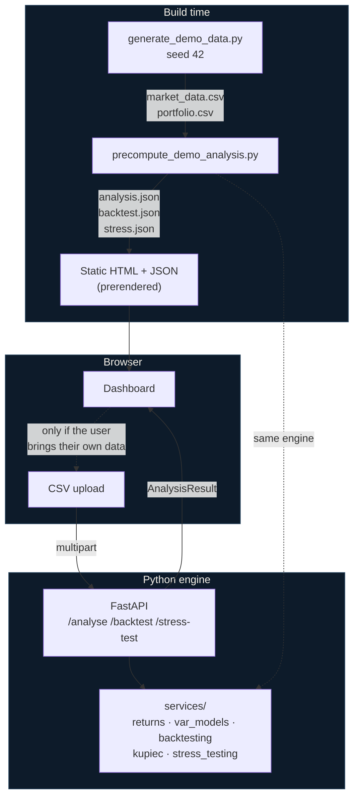

# Architecture

Why the system is shaped the way it is. The interesting decisions are not which
frameworks were used but where the numbers are computed and when.

---

## The shape of it



The dashed line matters: the precompute script and the API call **the same
service layer**. There is one implementation of every formula.

---

## Decision 1 — The demonstration is precomputed, not fetched

**The problem.** The single most important deliverable is a working website that
a reviewer opens once. Free hosting tiers put idle services to sleep; a cold
start can take most of a minute. A reviewer arriving at 11pm as the first
visitor in hours would see a spinner, and might close the tab.

**The decision.** Run the engine at build time, write the results to static
JSON, and import that JSON into the page. The demonstration path — what nearly
every visitor sees — is served as static HTML with no request to Python at all.

**What it costs.** The precomputed files must be regenerated whenever the engine
or the dataset changes, or the dashboard will display figures the current code no
longer produces. CI enforces this by regenerating and failing on any difference.

**What it is not.** It is not hard-coding results. The numbers come from the same
code the API runs, on a dataset frozen by checksum, and regenerating is one
command. The difference between caching and fabrication is whether the cache can
be reproduced from the source, and here it can be — verifiably.

**The bonus.** It also means the frontend deploys as a fully static site. If the
backend is unavailable, misconfigured, or removed entirely, the demonstration
still works.

---

## Decision 2 — The contract was written before the backend

`frontend/types/analysis.ts` was written in Phase 1, when the numerical engine
did not exist and the dashboard ran on a throwaway TypeScript mock.

That ordering was deliberate. It forced the interface to state what it needed —
including sign conventions, nullability, and the requirement that every response
carry its assumptions — before any implementation could quietly define those
things by accident. The Pydantic models in Phase 2 then had a fixed target to
satisfy rather than the reverse.

The two are kept aligned by convention rather than codegen: `analysis.py` mirrors
`analysis.ts` field for field, and both carry the same conventions comment. A
schema-parity check is part of any review of this repository.

**camelCase throughout.** The PRD shows snake_case JSON; a Pydantic alias
generator emits camelCase instead, so one naming convention holds end to end and
there is no mapping layer to drift out of sync.

---

## Decision 3 — SciPy is a test dependency, not a runtime one

The engine needs exactly two statistical functions, and both have closed forms
in the standard library:

| Need | Runtime | Verified against |
|---|---|---|
| χ²(1) survival function | `math.erfc(√(x/2))` | `scipy.stats.chi2.sf` |
| Normal quantile | `statistics.NormalDist().inv_cdf` | `scipy.stats.norm.ppf` |
| Kupiec statistic | log-likelihood difference | `scipy.stats.binom.logpmf` |

SciPy stays in the dev group and is used in tests as an **independent oracle**.

This is stronger evidence of correctness than calling SciPy in production would
have been. One implementation asserted is a claim; two independent
implementations agreeing to machine precision rules out an algebra error.

The size effect is secondary but real: runtime dependencies come to 79 MB against
a 250 MB serverless limit, and SciPy alone is 96 MB. Including it would still
have fit — the correctness argument is what motivated the choice.

---

## Decision 4 — Explicit slicing in the backtest loop

The walk-forward loop takes `values[t-window : t]` inside a plain Python `for`,
rather than using a vectorised rolling helper.

A rolling helper that quietly included the current observation would inflate
every model's apparent accuracy while leaving the output entirely plausible. That
failure is **invisible in the numbers** — the results would look reasonable, the
conclusions would be worthless, and nothing would signal the problem.

Since the project's central claim is that these forecasts never saw their own
outcome, the code that guarantees it is kept obvious at the cost of speed. The
guarantee is then tested adversarially: a future observation is replaced with a
−50% day and every forecast must be bit-for-bit unchanged.

---

## Decision 5 — CSV export is generated in the browser

Phase 6's exit condition is that exported content matches the on-screen analysis.

Building the CSV from the same objects the components render **guarantees** that
rather than testing for it. A server-side exporter would recompute, and
recomputation is precisely where the two could silently diverge.

---

## Layout

```
backend/
  app/
    api/v1/router.py         HTTP surface; parses uploads, never persists them
    schemas/analysis.py      Pydantic models, camelCase serialisation
    services/                the engine — no FastAPI imports, no SciPy
      returns.py             alignment, log returns, wealth, drawdown
      portfolio_metrics.py   volatility, max drawdown, HHI, sector weights
      var_models.py          historical, parametric Normal, EWMA
      expected_shortfall.py
      risk_contribution.py   covariance, correlation, Euler decomposition
      backtesting.py         walk-forward loop
      kupiec.py              unconditional coverage
      stress_testing.py      custom shocks, historical replay
      data_validation.py     PRD 8.5 checks
      analysis.py            orchestration
  scripts/
    generate_demo_data.py         seeded dataset + checksum manifest
    precompute_demo_analysis.py   runs the engine, writes the static JSON
  tests/                     329 tests

frontend/
  app/                       four routes, all statically prerendered
  components/
    analysis-data-provider   holds the displayed analysis; seeded with the demo
    analysis-params-provider holds user parameter selections
  lib/
    api.ts                   engine client, used only for uploads
    csv-export.ts            client-side export
    demo-data.ts             the precomputed payload
  public/demo/               frozen dataset + precomputed analysis
  tests/                     69 tests
```

The `services/` layer imports no web framework. It can be driven by the API, by
the precompute script, or by a notebook, and the tests exercise it directly.

---

## Deployment

Both halves deploy to Vercel from one repository: the Next.js site as static
output, and FastAPI as a Python serverless function under `api/`. Same origin, so
no CORS in production; `NEXT_PUBLIC_API_URL` exists for the case where the
backend lives elsewhere.

If the serverless bundle ever fails to fit, the fallback is Hugging Face Spaces
for the backend with `NEXT_PUBLIC_API_URL` pointed at it. Because the
demonstration is precomputed, that migration affects the upload feature only —
the site itself would keep working throughout.
